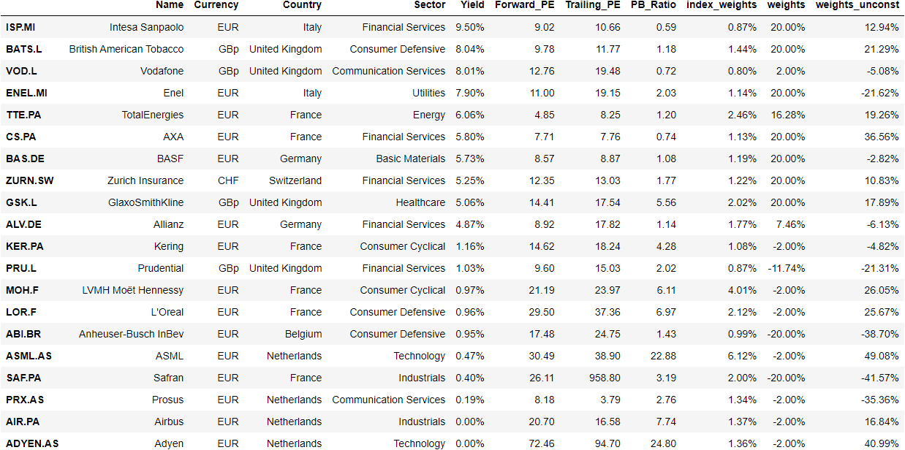

# Investments_Project

## Motivation

We implement a quantitative equity strategy whereby we select stocks from the Stoxx Europe 50 index which comprises of some of the largest companies in Europe.

Inspired by the "dogs of the dow strategy which predicts an outperformance of the 10 highest dividend yielding stocks in the dow vs the total index, we restrict the portfolio to be long in the top 10 dividend yielding stocks in the stoxx europe 50. Additionally, we go short in the 10 lowest yielding dividend stocks. This is motivated by the believe that after our in sample period ends (31.12.2021), rising interst rates and inflation will lead to a correlation breakdown between low and high dividend yield stocks where high dividend yield stocks will outperform short dividend yield stocks. 

The motivation behind shorting the 10 lowest paying dividend stocks is the believe that in 2022, inflation and thus interest rates will rise significantly, this ....

## Implementation

We caltulate the optimal weights by calculating the Maximum Sharp Ratio Portfolio with the following restrictions: 

- all long (short) investments  carry a minimum weight of 2& (-2%)
- The maximum value for long (short) investmnets is 20% (-20%)

- our backtesting period is: 2019 - end of 2021
- our out of sample period is: start of 2022 - 24.05.2022

## Results 
The table shows the selected stocks in the strategy as well as the weights allocated in our strategy and the weights that would have been used had we not implemented resrictions on the % value of money which can be inveted in a single stock.  

  

## Portfolio Characteristics

Our strategy significantly outperforms the benchmark in the in-sample as well as out-sample period. Further, most of the risk - return metrics are superior for the strategy as compared to the benchmark.

  
   

    &nbsp; &nbsp; &nbsp; &nbsp;&nbsp; &nbsp; 

  &nbsp; &nbsp; &nbsp; &nbsp;&nbsp; &nbsp; &nbsp; &nbsp; &nbsp; &nbsp; &nbsp;
   

